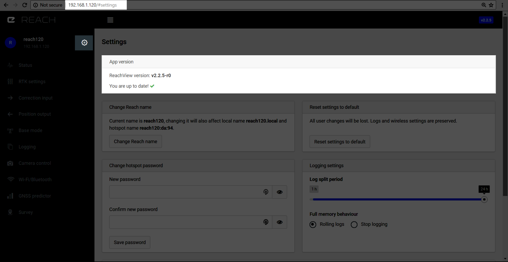
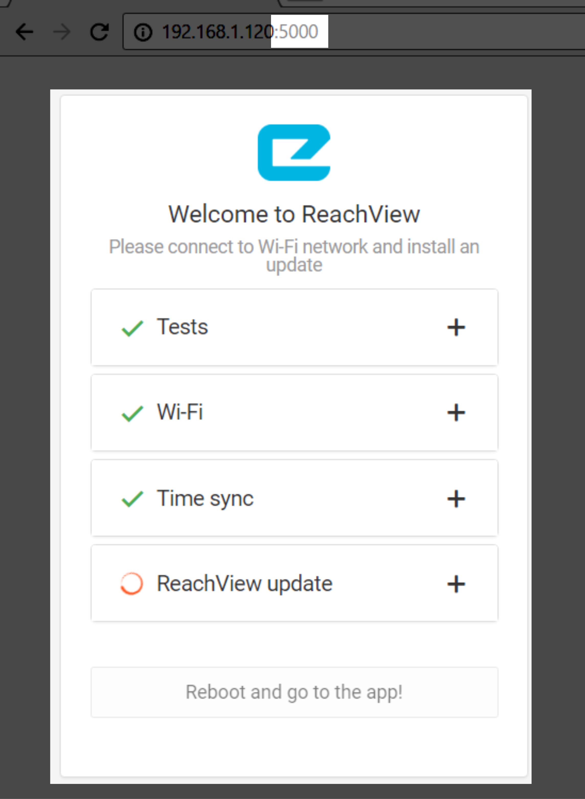

### Check app version  
Every time you power up Reach in a Wi-Fi network it will check for new ReachView update and notify you accordingly.

Note that the check is only done one time during boot process. If you want to force new version check please proceed to ReachView Updater. It is available on port 5000, for example http://reach.local:5000. It will automatically scan Emlid update servers when you open it.

### Change Reach name  
Reach name can be changed in order to distinguish between multiple devices. A very common pattern is to name devices according to their base or rover function. Device name is the base for hotspot name and local network name. The default name is “reach”, changing it will also affect local name “http://reach.local” and hotspot name “reach:xx:xx”.

### Reset settings to default  
Click “Reset setting to default” button to return all settings to factory configuration. Only logs and wireless settings are preserved. If you would like to perform a complete factory reset and wipe all your data you can [reflash firmware image]().

### Change hotspot password
Default hotspot password is “emlidreach”, you can change it for security reasons. If you forget your new hotspot password you can still access Reach by bringing it to a known Wi-Fi network. If you lost access to Reach you can [reflash firmware image](firmware reflashing) and set it up again.

### Logging settings
Full memory behaviour
Specify how ReachView will handle full memory behaviour here, it can either stop logging or override old logs in favour of new ones. In most cases “rolling logs” is recommended.

### Log split period
New log file will be created every N hours, while preserving previous log as well. This setting allows you to control the size of the files that you work with.

